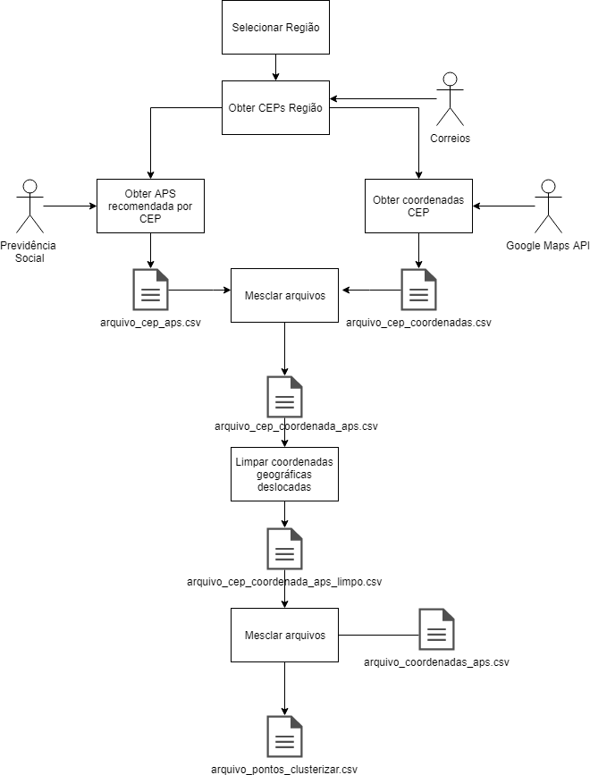

#Trabalho de Conclusão de curso de BigData

##Fluxo de tratamento da informação

## Descrição dos programas

||Descrição|
|--------------|-----------------|
|01obterAPSRecomendadaPorCEP.js|Consulta o serviço de recomendação de APS do INSS. Dado um CEP, retorna a APS.
|02obterCoordenadasCEP.js|Consulta o serviço do Google Maps API. Dado um CEP, retorna a coordenada geográfica associada.| 

||Descrição|
|--------------|-----------------|
|03mesclar_arquivos.R|Mescla arquivos com coordenadas e aps utilizando o CEP.
|04mesclar_arquivos_pontosclusterizar_aps.R|Mescla arquivos de pontos a clusterizar com as informações das APS.|
|05mesclar_arquivos_pontosclusterizar_pontosclusterizados.R|Mescla arquivos dos pontos a clusterizar com os pontos clusterizados.|
|06analise_resultados_obtidos.R|Calcula o desvio padrão dos grupos formados antes e depois da clusterização.|

||Descrição|
|--------------|-----------------|
|plot_kmeans_assumptions.ipynb|Notebook do Jupyter em Python que desempenha as funções descritas adiante.
|Função 1|Visualização dos dados antes da clusterizacao| 
|Função 2|Implementação do algoritmo K-means aplicada a massa de dados de CEPs das APS.|
|Função 3|Calcula as distancias to_be dos CEPs em relacao as APS| 
|Função 4|Calcula as distancias AS_IS, ou seja, em relação as agencias localizadas atualmente| 
 

